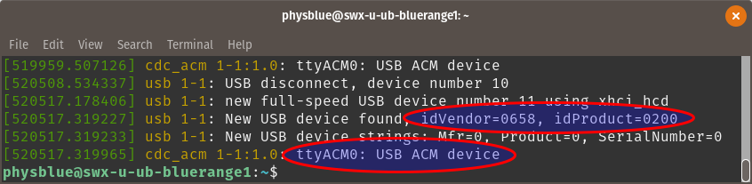
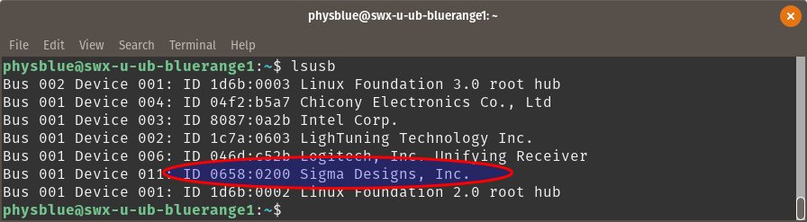

This page will walk through the steps to install Domoticz. You have two installation options: through a Docker container or through a local installation. Steps for both are included here.

## Domoticz Docker Container
### Find the USB location for container pass-through
When running the Docker container for Domoticz, you must specify a path to the USB device for the Domoticz container to follow. There are a few ways of doing this, and this document will outline using `dmesg` to find this path. Basically, `dmesg` is a Linux logging tool for device drivers, and you'll be concerned with only the most recent output from this tool:

1. Insert the Aeotec Z-Stick into a USB port on your computer.

2. Open a **Terminal** window, and enter:
`dmesg`

You're looking for the last few lines for `ttyACM#` or `ttyUSB#`, where # is a number. This corresponds to the device's _communication device class_ and path. As an example. refer to the screenshot below:


In the above example, our path would be `/dev/ttyACM0`.  Also take note of the **idVendor** and **idProduct** fields. Use these to confirm the correct path by listing all usb devices:
```
lsusb
```
You should find your Z-Stick with `Sigma Designs, Inc.` as a manufacturer, and the `ID` will match the numbers you noted in the previous step. An example below:


The ID matches the **idVendor**:**idProduct** from above, confirming the correct path as `/dev/ttyACM0`.

### Building and running the Domoticz container

1. In a **Terminal** window, clone the dockerized Domoticz repo from the SOFWERX Github:
```
git clone https://github.com/sofwerx/docker-domoticz.git
```
2. Navigate to the cloned directory:
```
cd /home/(your user name)/docker-domoticz
```
3. Use docker-compose to build the Domoticz image (This may take a few minutes).
```
sudo docker-compose build
```
4. Create a container from the image:
```
sudo docker create \
--name=domoticz \
--net=bridge \
-d \
-p 8080:8080 \
--device=[path to your usb device] \
sofwerx/domoticz
```
 Explanation of options from above:
 * `--name` refers to the container name. You can choose whatever name you wish.
 * `--net`  refers to the network adapter. Choose `bridge` to make the container accessible on your network.
 * `-d` will run the container in _detached_ mode, ie in the background.
 * `-p` is the port the web server will use for the Domoticz UI. Here, the `8080` port will be mapped to the `8080` port on your local machine. If you're already using that port, feel free to change it to something else, ie `-p 8080:8081`
 * `device=` refers to the usb path location. Using the example from the previous section, we would use `device=/dev/ttyACM0`.

5. Now run your newly built container:
```
sudo docker start <your container name>
```

6. Navigate your web browser to `localhost:8080` to access the Domoticz dashboard. If connecting from another computer on the same network, you may access by `<host ip address>:8080`.


## Local Installation
1. Download the  Domoticz tar file [here](https://releases.domoticz.com/releases/release/domoticz_linux_x86_64.tgz).
2. Extract the contents and navigate to its directory.
```
tar -xvzf /your/download/location/domoticz_linux_x86_64.tgz
```
3. Navigate to the newly created directory and start Domoticz by running Domoticz.sh
4. Navigate your web browser to localhost:8080 to access the Domoticz dashboard.
