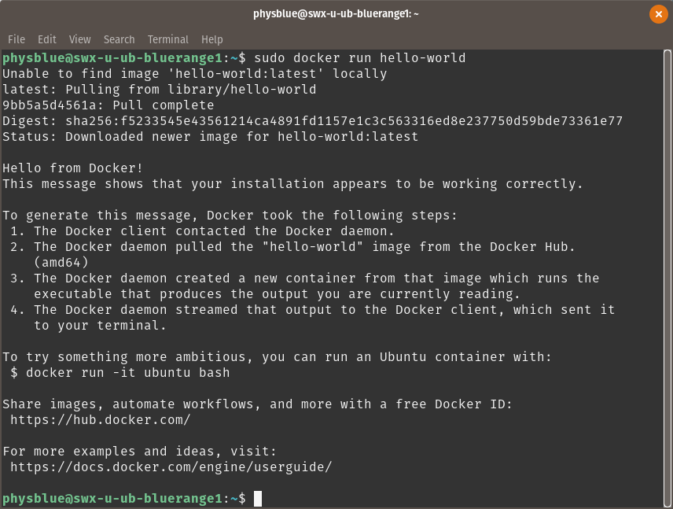

Many tools used in this project are cross-platform, and users have many choices of software and hardware configurations that will have the same capabilities as the system used in the safe house. The following pages will walk through the setup and configuration of our operating environment. The operating systems used in this instance were PopOS! 17.10 and Ubuntu 16.04.

## Ubuntu Installation
The Ubuntu version used in this project is 16.04. Canonical has since released a new LTS version, 18.04 (Bionic Beaver). As of this writing, it's believed that there are no compatibility issues between the two releases for the purposes of this project.

### Download Ubuntu 16.04/Pop!OS and Create Bootable Installation Media
* Download the [Ubuntu](http://releases.ubuntu.com/16.04.4/) or [Pop! OS](https://system76.com/pop) disk image. Choose the appropriate (64-bit or 32-bit) option for your computer.
* Create a bootable USB drive.

**From Windows**
1. Connect a USB drive to your computer. **Its contents will be erased during this process.** It must be at least 2GB in storage capacity.
2. Download and run [Rufus](https://rufus.akeo.ie/downloads/rufus-2.18.exe).


3. From the Device dropdown list, select your inserted USB drive.
4. Enter a volume label of your choice.
5. Ensure the file system is set to **FAT32**, partition scheme is **MBR**, and the **Quick Format** option is selected.
6. Check the **Create a bootable disk using ISO image** box.
7. Click on the **disk icon** to the right of the previous option. A pop-up field will prompt you to navigate to the download location for your Ubuntu disk image. Select the image and click **Ok**.
8. Click **Start** and follow the onscreen prompts. The result will be a formatted USB drive ready to boot the Ubuntu installation medium.

***

**From MacOS**
1. Connect a USB drive to your computer. **Its contents will be erased during this process.** It must be at least 2GB in storage capacity.
2. Launch **Disk Utility** from **Applications>Utilites** or use Spotlight search.

3. Select the USB drive from the list of external storage devices on the left.
4. Click the **Erase** button near the top of the window.
5. In the resulting pop-up menu, choose a volume name, and ensure the format is set to **MS-DOS (FAT)** and the scheme is set to **GUID Partition Map**. Then click **Erase** on the bottom right of the window.
6. Download, install, and run [Etcher](https://etcher.io/).

7. Click **Select image** and navigate to the Linux image download location. Click **Select drive** and choose your USB storage device. Click **Flash!** and follow the on-screen prompts to create your bootable Linux installation drive.

***
### Install Ubuntu 16.04 or Pop! OS
**This process will erase the storage contents of the host computer.** You must have at least 25GB of storage space.

With your formatted Ubuntu installation drive still inserted:
1. Restart your computer.
2. **On a Mac**, hold down the **Option/alt (⌥)** key while the computer starts. You'll be presented with a selection of storage media to choose from. Select the your USB drive, usually labeled **EFI Boot** and with a gold/white icon.

   **On a PC**, hold down **F12** while your computer starts. You'll be presented with a list of storage media to choose from, so select your USB drive.
**Note:** The manufacturer of your computer determines the appropriate key to hold down to reach the boot selection menu. If F12 does not work, please consult your computer's manual to find the right key.

3. Follow the on-screen prompts to select the appropriate installation options for your computer. The installation wizard will guide you through the process, typically 10 minutes.

***
## Update
Once you have either Ubuntu or Pop!OS installed, it's a good idea to install updates.
1. Click **Activities** in the upper left corner.
2. In the pop-in dashboard, type **Terminal** in the search bar and click on the icon to open a Terminal window. You can also drag the icon to keep in your Favorites on the left.
3. Enter the following commands:

`sudo apt-get install update`

`sudo apt-get install upgrade`


## Docker
Docker is virtualization software used to rapidly deploy applications. For the purposes of replicating our safe house configuration, you will need to install Docker. The process is the same whether you install Ubuntu or PopOS!. We'll be using Docker Community Edition for this project. There are a few installation methods, but the most recommended is installation from Docker's repository.

### Setting up Docker's Repository
1. Click **Activities** in the top left corner, and open a **Terminal** window.
2. Update your package index by entering:

`sudo apt-get update`

3. Enable repository usage over HTTPS by entering the following command (enter 'y' when prompted):

```
sudo apt-get install \
    apt-transport-https \
    ca-certificates \
    curl \
    software-properties-common
```

4. Include Docker's GPG key so that APT can authenticate Docker packages:

`curl -fsSL https://download.docker.com/linux/ubuntu/gpg | sudo apt-key add -`

5. Now add the external stable Docker repository to the APT package manager:

```
sudo add-apt-repository \
   "deb [arch=amd64] https://download.docker.com/linux/ubuntu \
   $(lsb_release -cs) \
   stable"
```

### Installation
Now that APT is configured to use Docker's repo, installation is simple.
1. Update the package index with:

`sudo apt-get update`

2. Install Docker Community Edition with:

`sudo apt-get install docker-ce`

**Note:** If you encounter an error **E: Package 'docker-ce' has no installation candidate**
please refer to step 5 in the previous section, and replace **$(lsb_release -cs)** with the version name depending on your OS version number:


| Ubuntu/Pop!OS Version  | Name |
| ------------- | ------------- |
| 16.04  | **xenial**  |
| 17.10  | **artful** |
| 18.04  | **bionic**  |

Example for 18.04:
```
sudo add-apt-repository \
   "deb [arch=amd64] https://download.docker.com/linux/ubuntu \
   bionic \
   stable"
```

Then run `sudo apt-get install docker-ce` again.


3. You can verify correct installation by entering:

`sudo docker run hello-world`

Sample output:



4. Install docker-compose with the following command
```
sudo curl -L https://github.com/docker/compose/releases/download/1.21.2/docker-compose-$(uname -s)-$(uname -m) -o /usr/local/bin/docker-compose
```
And make it executable with:
```
sudo chmod +x /usr/local/bin/docker-compose
```

## Git
If you haven't already, install Git with:
`sudo apt-get install git-all`
