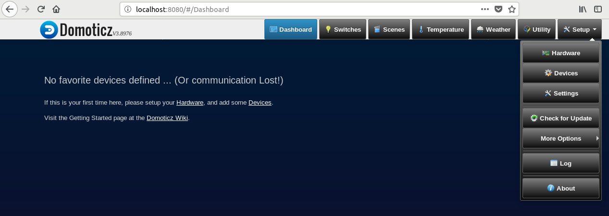
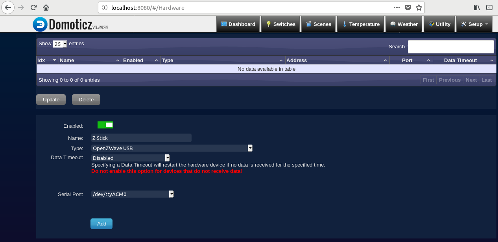
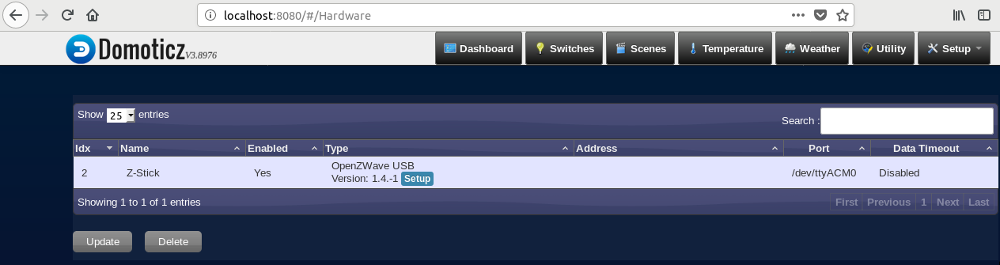
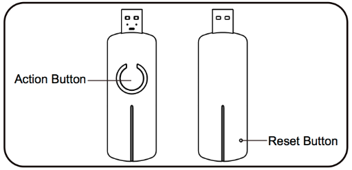
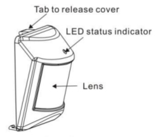
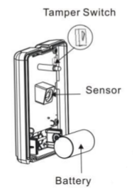
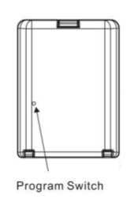
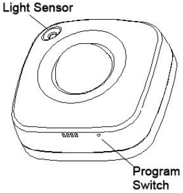
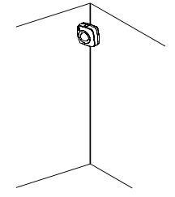
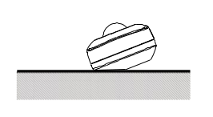

With Domoticz up and running, you may proceed to adding your first devices to the safe house security system. This page will outline the steps to add your Z-Wave devices to communicate with Domoticz. While it's possible to accomplish this entirely through the Domoticz dashboard, the following steps will follow recommendations from the manufacturer since their method produces clearer signs of successful pairing.

The page will first provide a walk through on installing your Aeotec Z-Stick controller, and will then describe the integration of the two types of motion sensors into the Domoticz system. Finally, some suggestions on cleanup are provided to make data gathering simpler.

**Note:** Domoticz uses the Open Z-Wave standard. If using a Z-Wave sensor not listed in the Device overview page, please ensure its compatibility with Open Z-Wave by referencing the list of supported devices [here](https://github.com/OpenZWave/open-zwave/tree/master/config).

## Controller Installation
1. With the Z-Stick still inserted, navigate your web browser to the Domoticz Dashboard.
2. In the Domoticz dashboard, navigate to **Setup > Hardware**.

3. Below the device list (which should be empty on a fresh install), You'll see the form to add new hardware. Enter a **Name** for your Z-Stick, and from the **Type** dropdown, choose **OpenZWave USB**. The items are in alphabetical order.

4. For **Serial Port**, select the device location, usually **/dev/ttyACM0** or similar.
5. Click **Add**. The page will refresh and the device list will update, showing the Z-Stick.

## Sensor-Controller Pairing
For pairing, have the sensor and the USB stick as close as possible, ie pair the sensors first, then mount/position them where you'd like.

1. Unplug the Z-Stick, and press the **Action** button on top. The LED circle will slowly flash blue
indicating that it's ready to pair.

2. For each sensor, press the **Program** button.

 **For the ZP3102:**
 * Open the motion sensor by gently lifting the tab on the top. Insert the CR17345 battery into the bottom slot and replace the lid.
 * On the back of the device, there is a small recess leading to the **Program** switch. Insert a paperclip into this opening to pair the device with the Z-Stick controller.
 * Almost instantly you will see the LED around the Z-Stick's Action button flash quickly. This indicates successful pairing. The Z-Stick will then resume it's slow flashing, indicating readiness to pair another device. This will last for 30 seconds.

 
 
 

 **For the ZP3111:**
 * Open the sensor by gently releasing the security tabs on the top of the device. Insert the AAA batteries and replace the lid.
 * If it isn't already in pairing mode, press the **Action** button on the Z-Stick. The LED ring will start to slowly flash blue.
 * With a paperclip, press the **Program** switch on the bottom right of the sensor. You will see the Z-Stick quickly flash blue to indicate successful pairing.

3. Replace the Z-Stick into the host computer.
4. The sensors will be displayed in the Domoticz dashboard under **Switches** and **Setup > Devices**.

**Note:** It may take a few minutes for the Domoticz device list to refresh and display the sensors.

## Sensor Location
Place the sensors within 10 meters of each other. This may be a shorter distance depending on obstructions like walls or ceilings. The nature of the Z-Wave network makes it extensible as long as there's a path of Z-wave devices, or nodes, for a signal to follow. If mounted on a wall, ensure the sensor is at least 5 feet from the ground. If on the ground, ensure the sensor is pointed upwards.

