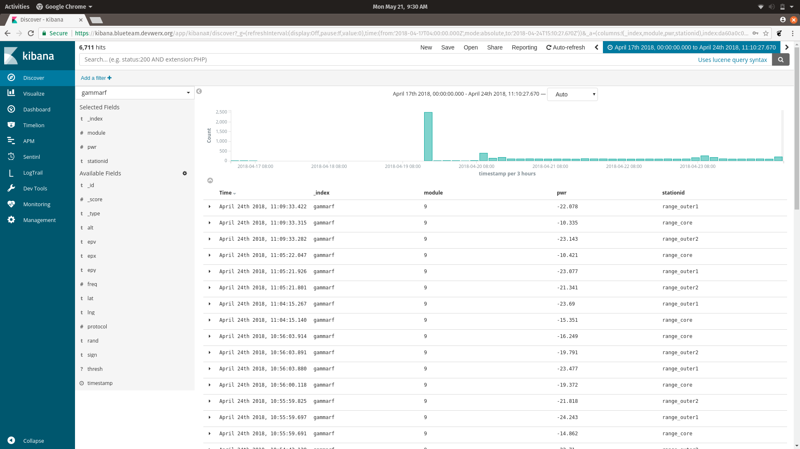

## ElasticSearch
After setup of the all the initial components defining a organized location to store all the collected data is very important. This is done trough the setup and use of a database, an example of which is ElasticSearch. This would most efficiently be set through Docker and the following ElasticSeach [build](https://github.com/sofwerx/docker-elastic) The first step is installing the Docker and Compose library by running `install docker - compose`.

With Docker configured, going within the directory of the cloned repository for the ElasticSeach build and executing `docker-compose up` in terminal. To test you can check the following [link](http://localhost:5601/app/kibana#/home?_g=()) for activity. To establish the input link to attach to the connector module in GammaRF you need the Local IP of the device hosting the database within the monitored network, followed by the index you wish the data to be labeled under and the subindex (Example `http://192.168.0.129:9200/gammarf/asdf`).

