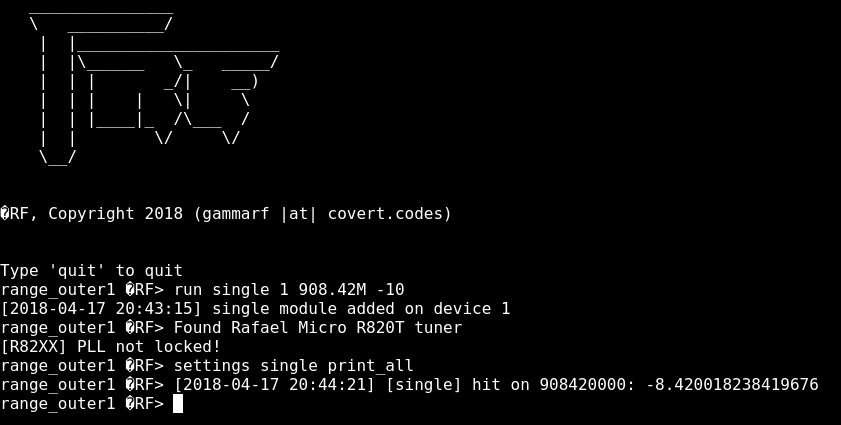

## Running All Initialized Components
After all hardware and software is properly configured, initialization of each node, specifying its role and starting its activity is the final part of the setup. To startup a station you begin by executing the `sudo ./prepare.sh` command followed by a `sudo ./rungrf.sh`. Next up is identifying the possible commands within GammaRF through inputting the -help command. This will list all the possible inputs like viewing all connected devices or even running a module on a frequency. Exploring these options is vital for properly implementing the right module and initializing the proper monitoring.

To begin capturing data and viewing all the inputs captures you may resort to the `run` command with the included module, for monitoring wide spectrum `scanner` or `single` for a single frequency like Z-Wave, finally a digit to define which device it will run on. For a wide spectrum of frequencies you will need add each frequency separately. Through using the `interesting_add [Frequency in Hz]`, a frequency is designated to the list of what is watch and recorded. Setting the right parameter in the Single module is important, with it being low, allows for interference to be passed trough the filter, on the other hand a higher parameter will result in not registering all the data hits. Finally seeing what will is captured and listed in the GammaRF interface is important to verify data input in ElasticSearch. This is done through the `settings` input.

