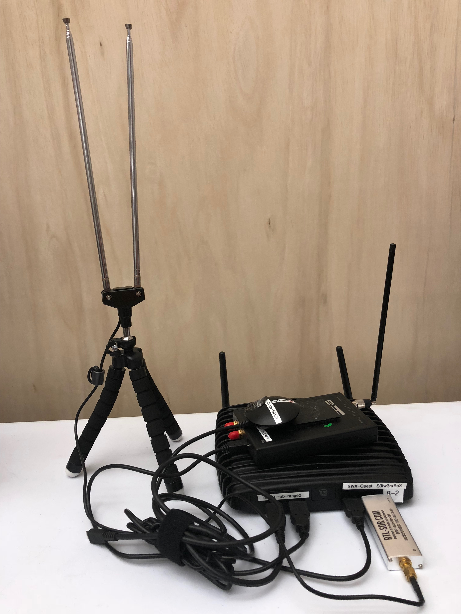

# Mad-Jack
Mad Jack's Cyber Range RF Lane Project

This Repo will serve as documentation of the needed steps to understand and recreate the RF monitoring system created. It covers and portrays the needed components for successful implementation and use of the system. The system providesa method of identifying, gathering, and organizing Radio Frequency (RF) signal data with the help Open of Source Software(OSS).

Used Monitoring Station:

