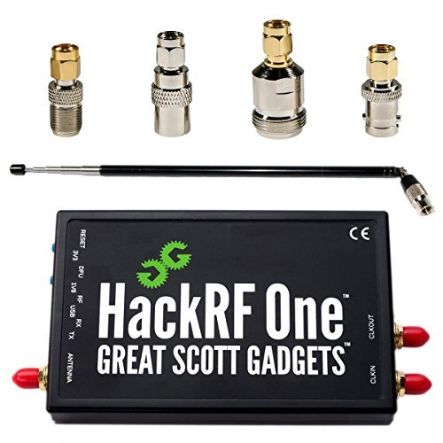

## Software Defined Radio Setup
The SDR tools used for the project are mainly limited to HackRF and RTL-SDR. However if there is a need for jamming, for testing purposes, BladeRF and its configuration are covered in the testing tab.

RTL-SDR setup is summarized with the following commands listed in the Driver [Installation](https://ranous.files.wordpress.com/2018/02/rtl-sdr4linux_quickstartv2-18.pdf) section in the guide by Kenn Ranous. To test if your RTL-SDR is properly recognized when connected type the following command in terminal: `rtl_test -t`

HackRF setup is summarized with the following commands listed in the [Github](https://github.com/mossmann/hackrf/wiki/Operating-System-Tips) page of the HackRF developer, Michael Ossmann. Through following the prepare instruction and installation through package manager, your system will be ready to use a HackRF.

Testing the HackRF connection, once the installation is complete, can be done through the following command in terminal: `hackrf_info`

